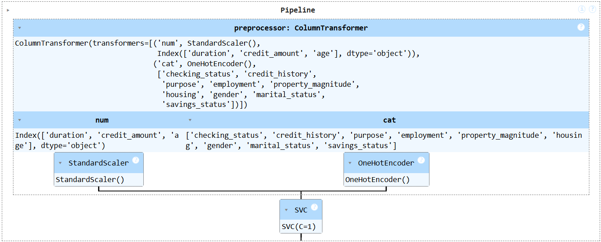

# German Credit Data Analysis and Predictive Modeling

## Project Overview
This project involves analyzing and building predictive models on the German Credit dataset. The goal is to identify important factors influencing credit decisions and build a robust pipeline to predict creditworthiness. The project workflow spans data cleaning, exploratory data analysis (EDA), feature engineering, model building, and testing, all of which are seamlessly integrated into an  . This app allows users to explore visualizations and findings of the analysis and utilize the deployed model for real-time classification and predictions.

Link to Website: [German Credit Risk Analysis and Modeling](https://german-credit-analysis-and-modelling-by-dhruv-limbani.streamlit.app/)

Conclusion: Achieved 78% accuracy and 77.36% precision using Support Vector Machine (c=1, kernel='rbf')

### Notebooks Summary

#### 1. German Credit Data Analysis and Predictive Modeling.ipynb
This notebook includes:

1. **Data Loading**: Encoding and decoding non-numeric data types for consistency.
2. **Understanding Data**: Analysis of data types and unique values in each column.
    - Adjustments made to ensure uniqueness in `credit_history` and splitting `personal_status` into `gender` and `marital_status` columns.
3. **Outlier Detection**: Visual exploration of critical attributes:
    - Observations for `duration` and `credit_amount` revealed their importance in distinguishing target classes.
4. **Exploratory Data Analysis (EDA)**:
    - **Univariate Analysis**: Highlighted target class imbalance.
    - **Bivariate Analysis**:
        - **Numerical Attributes**: Identified significant differences in `duration`, `credit_amount`, and `age` between good and bad credit.
        - **Categorical Attributes**: Proportional analysis due to target class imbalance.
    - **Multivariate Analysis**: Key findings include correlations between `duration` and `credit_amount`, and between `age` and `residence_since`.
5. **Feature Importance**:
    - Techniques used:
        - Random Forest Classifier (Ensemble Learning - Bagging)
        - Gradient Boosting Classifier (Ensemble Learning - Boosting)
        - Chi-Square Test for Independence
        - ANOVA F-test for Numerical-Categorical Relationships
        - Point Biserial Correlation for Numerical-Binary Relationships
        - Mutual Information for Dependency Assessment
    - Cross-validation of EDA findings with feature importance rankings.
6. **Data Saving**: Cleaned data with important attributes stored for subsequent steps.

#### 2. Model Building.ipynb
This notebook includes:

1. **Loading Data**: Preparing the dataset for modeling.
2. **Normalizing Numerical Attributes**: Ensuring numerical attributes are scaled appropriately.
3. **Encoding Categorical Variables**: Transforming categorical data into numerical format.
4. **Training and Testing Dataset**: Splitting the data into train and test sets.
5. **Elimination of Class Imbalance**: 
    - Techniques explored:
        - Oversampling minority class (e.g., duplicating data or using SMOTE).
        - Undersampling majority class.
        - Combined Over- and Undersampling.
    - Decision: Used the first technique (SMOTE) due to limited data availability.
6. **Hyperparameter Tuning and Model Building**:
    - Several configurations were tested:
        - **HPT with all combined attributes (EDA + other techniques) and SMOTE**.
        - **HPT with only EDA-based important attributes and SMOTE**.
        - **HPT with only other techniques-based important attributes and SMOTE**.
        - **HPT with all combined attributes (EDA + other techniques) without SMOTE**.
        - **HPT with only EDA-based important attributes without SMOTE**.
        - **HPT with only other techniques-based important attributes without SMOTE**.
    - **Final Conclusion**:
        - Models without oversampling the minority class (using SMOTE) and employing stratification during train-test splits yielded higher accuracy compared to other methods.
    - **Ranking of Methods Based on Test Accuracy and Corresponding Models**:
        1) HPT with only onther techniques based important attributes without SMOTE - SVM (c=1, kernel='rbf') - (Accuracy-78%, Precision-77.36%)

        2) HPT with all the combined attributes (from EDA + other techniques) without SMOTE - SVM (c=1, kernel='rbf') - (Accuracy-77.6%, Precision-76.98%)

        3) HPT with only EDA based important attributes without SMOTE - Logistic Regression (c=0.1) - (Accuracy-77%, Precision-75.81%)

        4) HPT with only EDA based important attributes and SMOTE - Gradient Boosting - (Accuracy-74.3%, Precision-73.8%)

        5) HPT with only onther techniques based important attributes and SMOTE - Random Forest - (Accuracy-74.3%, Precision-73.17%)

        6) HPT with all the combined attributes (from EDA + other techniques) and SMOTE - Logistic Regression (c=0.1) - (Accuracy-73.3%, Precision-76.52%)

#### 3. Model Testing on Raw Dataset.ipynb
- Tests models on the raw dataset to assess their generalizability.

#### 4. Pipeline.ipynb
- Combines preprocessing, feature engineering, and model prediction into a single pipeline for deployment.

### Resources
- `label_encoder.pkl`: Stores label encoders for categorical variables.
- `pipeline.pkl`: Serialized pipeline for deployment.

    

### Scripts
- **german-credit-app.py**: Streamlit-based application for interacting with the model.
- **pipeline.py**: Contains functions for preprocessing and model inference.

### Dependencies
All dependencies are listed in `requirements.txt` for easy installation.

---

